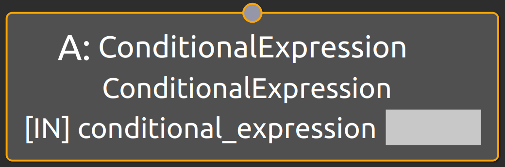
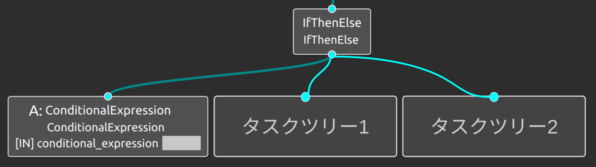

ConditionalExpression
===================================

概要
-----------

Local Blackboad上の値を読み出してきて条件判定を行うノードである。
従来、IntやBoolなどのデータ型に応じて条件判定ノードが異なっていたり、複雑な条件式に対応できておらず利便性が低かったので
本ノードの実装に至った。
本ノードでは内部的にExprtkを使用しており、複雑な条件判定式にも対応している。

使用方法
-----------
- **conditional_expression** : 条件判定式を指定

  
.. raw:: html

     

動作内容
------------
実行されると、条件判定式上で指定したLocal Blackboardのキーをもとにデータを読み出して
conditional_expressionポートで指定した条件判定式を評価する。
条件判定結果がtrueであれば親ノードにSUCCESSという状態信号を返却し、falseであればFAILUREという状態信号を返却する。
以下に示すように、IfThenElseと併用される。

  
.. raw:: html

     

この場合、条件判定の結果がtrueであればタスクツリー1が、falseであればタスクツリー2が実行される。
