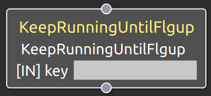

KeepRunningUntilFlgup
===================================

概要
-----------

Local Blackboad上の値を読み出してきて再帰動作の継続判定を行うノードである。
Local Blackboard上に格納したbool型のパラメータの値を読み出してきて、これをもとに再帰判定を行う。

使用方法
-----------
- **key** : Local Blackboad上のパラメータのキーを指定

  
.. raw:: html

     

動作内容
------------
実行されると、keyポートで指定したLocal Blackboardのキーをもとにデータを読み出して
再帰動作の継続判定を行う。
読み出してきた値がtrueならそこで処理を終え、親ノードに状態信号SUCCESSを返す。
また、読み出してきた値がfalseなら、親ノードに状態信号RUNNINGを返却し、子ノードを再度呼び出す。
