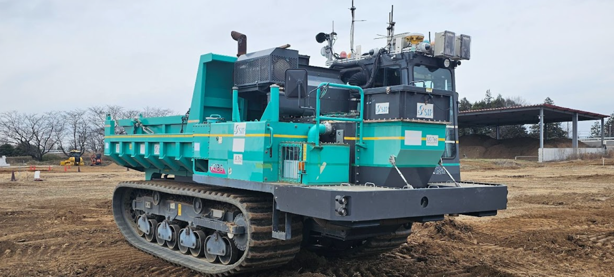

LeafNodeIc120
===================================

概要
-----------
共通制御信号対応クローラダンプIC120を操作するSubtask Nodeを接続するLeaf Node。

.. image:: ../images/LeafNodeIc120.png
   :alt: LeafNodeIc120
   :width: 200px
   :align: center  
  
.. raw:: html

     

入力ポート
-----------
- **model_name** : "ic120"と指定
- **record_name** : 接続するSubtask Nodeの仕様に合わせたパラメータデータのrecord_nameの値を指定
- **subtask_node** :  :doc:`subtask_ic120_navigate_anywhere <SubtaskIc120NavigateAnywhere>`, :doc:`subtask_ic120_navigate_anywhere_deg <SubtaskIc120NavigateAnywhereDeg>`, :doc:`subtask_ic120_follow_waypoints <SubtaskIc120FollowWaypoints>`, :doc:`subtask_ic120_follow_waypoints_deg <SubtaskIc120FollowWaypointsDeg>`, :doc:`subtask_ic120_navigate_through_poses <SubtaskIc120NavigateThroughPoses>`, :doc:`subtask_ic120_navigate_through_poses_deg <SubtaskIc120NavigateThroughPosesDeg>`, :doc:`subtask_ic120_release_soil <SubtaskIc120ReleaseSoil>`  のいずれかを指定

.. raw:: html

     

共通制御信号対応クローラダンプ IC120 (土木研究所所有)
-----------

