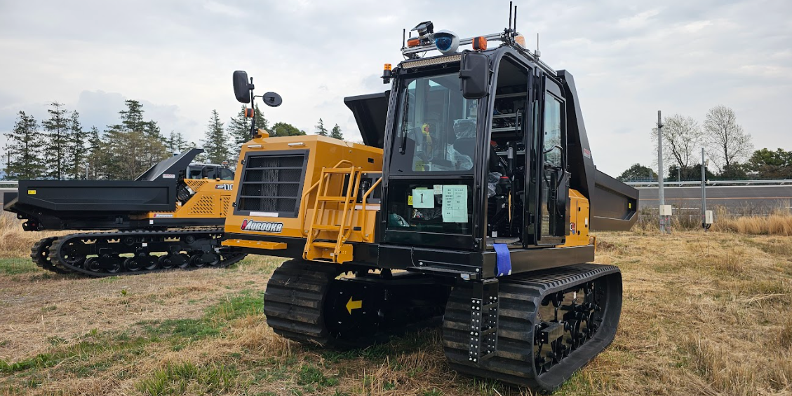

LeafNodeMst110cr
===================================

概要
-----------
共通制御信号対応クローラダンプMST110CRを操作するSubtask Nodeを接続するLeaf Node。
OperaSim-PhysX/AGX及び実機に対応。

.. image:: ../images/LeafNodeMst110cr.png
   :alt: LeafNodeMst110cr
   :width: 200px
   :align: center  
  
.. raw:: html

.. raw:: html

     

入力ポート
-----------
- **model_name** : "mst110cr"と指定
- **record_name** : 接続するSubtask Nodeの仕様に合わせたパラメータデータのrecord_nameの値を指定
- **subtask_node** :  :doc:`subtask_mst110cr_navigate_anywhere <SubtaskMst110crNavigateAnywhere>`, :doc:`subtask_mst110cr_navigate_anywhere_deg <SubtaskMst110crNavigateAnywhereDeg>`, :doc:`subtask_mst110cr_follow_waypoints <SubtaskMst110crFollowWaypoints>`, :doc:`subtask_mst110cr_follow_waypoints_deg <SubtaskMst110crFollowWaypointsDeg>`, :doc:`subtask_mst110cr_navigate_through_poses <SubtaskMst110crNavigateThroughPoses>`, :doc:`subtask_mst110cr_navigate_through_poses_deg <SubtaskMst110crNavigateThroughPosesDeg>`, :doc:`subtask_mst110cr_release_soil <SubtaskMst110crReleaseSoil>` のいずれかを指定

.. raw:: html

     

共通制御信号対応クローラダンプMST110CR (土木研究所所有)
-----------

