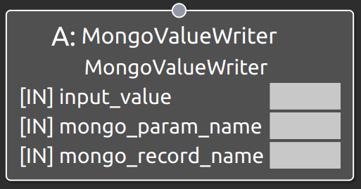

MongoValueWriter
===================================

概要
-----------

タスクからMonogDB上のパラメータの値を上書きするためのノードである。

使用方法
-----------
- **mongo_record_name** : Local Blackboad上のパラメータデータ検索用のキーを指定
- **mongo_param_name** : Local Blackboad上のパラメータデータ上の、値を更新するパラメータを指定
- **input_value** : 更新する値を指定

  
.. raw:: html

     

動作内容
------------
実行されると、mongo_record_nameポートで指定した値をもとにデータベース上から
該当するパラメータデータを検索し、そのパラメータデータの中からmonogo_param_nameポートで指定した
パラメータの値をinput_valueで指定した値で更新する。

