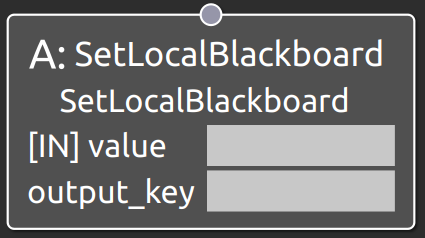

SetLocalBlackboard
===================================

概要
-----------

タスクからLocal Blackboardへの値の書き込みを行うノードである。
BehaviorTree.CPPには、SetBlackboardという同様の機能を持つノードが用意されている。
一方で、SetBlackboardを使用してLocal Blackboardへの値の書き込みを行うと全て文字列型として格納されてしまう欠点があった。
そこで、今回新たに本ノードを実装するに至った。
本ノードでは入力値をBool, String, int, doubleから自動で判別し、それに応じたデータ型でLocal Blackboardへデータを格納する。

使用方法
-----------
- **output_key** : Local Blackboad上の値を更新する対象のパラメータのキーを指定
- - **value** : 更新する値を入力

  
.. raw:: html

     

動作内容
------------
実行されると、output_keyポートで指定した値をもとにLocal Blackboard上から
該当するパラメータデータを検索し、そのパラメータの値をvalueポートで指定した値で更新する。

