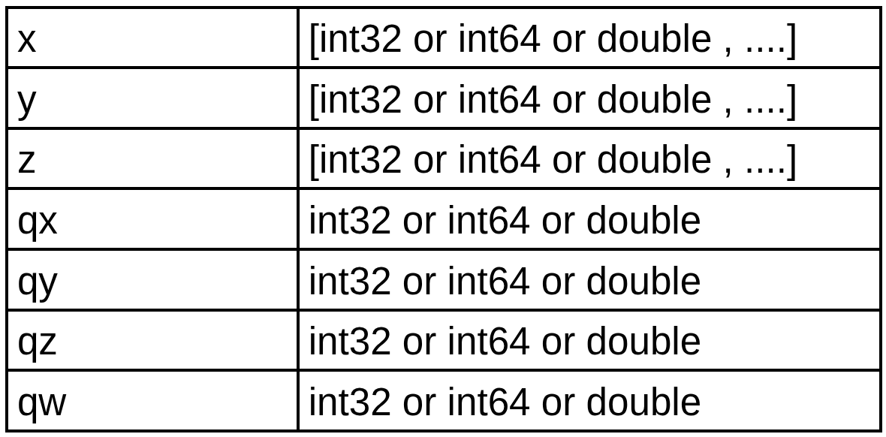

subtask_ic120_follow_waypoints
===================================

概要
-----------
共通制御信号対応クローラダンプIC120をナビゲーション操作するSubtask Nodeの1つ。
ダンプの移動経路をNavigate Through Posesに従って指定する。
Navigate Through Posesではsubtask_ic120_follow_waypoints同様に
経路上の複数点に沿ったナビゲーションを行うものの、経路上の経由地点では位置合わせのみを
行う。
subtask_ic120_navigate_through_poses_degと機能は同じであるが、姿勢はquaternionを用いて指定する点が異なる。

対応表
-----------

.. image:: ../images/対応表_simok_actok.png
   :alt: 対応表
   :width: 800px
   :align: center  

.. raw:: html

     

使用方法
-----------
- **model_name** : "ic120"と指定
- **record_name** : 接続するSubtask Nodeの仕様に合わせたパラメータデータのrecord_nameの値を指定
- **subtask_node** :  "subtask_ic120_nvigate_through_poses"と指定。

.. image:: ../images/SubtaskIc120NavigateTheoughPoses.png
   :alt: SubtaskIc120NavigateTheoughPoses
   :width: 400px
   :align: center  
  
.. raw:: html

.. raw:: html

     

パラメータデータの仕様
-----------

各配列の要素番号NはN個目のウェイポイントの値として指定する。
姿勢はmap座標からみたbase_link座標の相対位置姿勢であり、位置はxyzのm基準、姿勢はquaternionで指定する。

※_id, model_name. description, record_name等の共通仕様は除外

サンプル
-----------

**動作** : Map座標基準のx軸方向1m, 2m, 3m地点を経由して移動。各地点ではbase_linkとmapの姿勢を合わせる。

.. image:: ../images/Sample_SubtaskIc120NavigateThroughPoses.svg
   :alt: Sample_SubtaskIc120NavigateThroughPoses
   :width: 400px
   :align: center  
