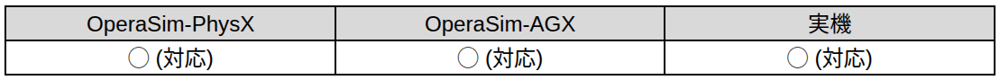
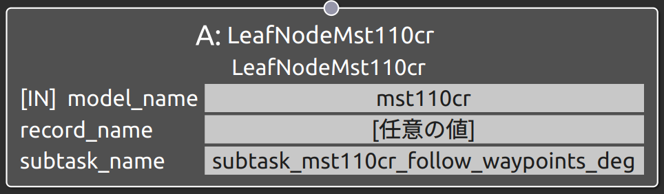
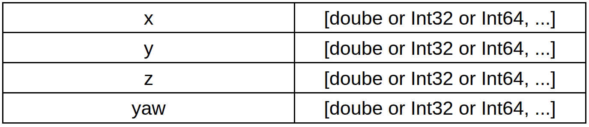
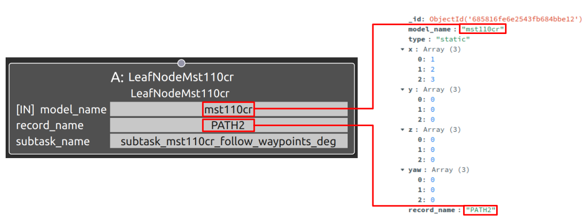

subtask_mst110cr_follow_waypoints_deg
===================================

概要
-----------
共通制御信号対応クローラダンプMST110CRをナビゲーション操作するSubtask Nodeの1つ。
ダンプの移動経路をWaypointsを使用して指定し、それに沿ってナビゲーションを行う。
subtask_mst110cr_follow_waypointsと機能は同じであるが、姿勢はdegreeを用いて指定する点が異なる。

対応表
-----------

.. raw:: html

     

使用方法
-----------
- **model_name** : "mst110cr"と指定
- **record_name** : 接続するSubtask Nodeの仕様に合わせたパラメータデータのrecord_nameの値を指定
- **subtask_node** :  "subtask_ic120_follow_waypoints_deg"と指定。

  
.. raw:: html

.. raw:: html

     

パラメータデータの仕様
-----------

各配列の要素番号NはN個目のウェイポイントの値として指定する。
姿勢はmap座標からみたbase_link座標の相対位置姿勢であり、位置はxyzのm基準、姿勢はdegreeで指定する。

.. raw:: html

     

※_id, model_name. description, record_name等の共通仕様は除外。詳しくは :doc:`こちら <../DataBase>` へ。

サンプル
-----------

**動作** : Map座標基準のx軸方向1m, 2m, 3m地点を経由して移動。各地点ではbase_linkとmapの姿勢を合わせる。

