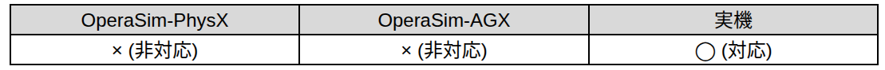

subtask_mst110cr_release_soil
===================================

概要
-----------
共通制御信号対応クローラダンプMST110CRを操作するSubtask Nodeの1つ。
ベッセルの目標放土角度を指定し、放土動作を行う。

対応表
-----------

.. raw:: html

     

使用方法
-----------
- **model_name** : "mst110cr"と指定
- **record_name** : 接続するSubtask Nodeの仕様に合わせたパラメータデータのrecord_nameの値を指定
- **subtask_node** :  "subtask_mst110cr_release_soil"と指定。

.. image:: ../images/SubtaskMst110crReleaseSoil.png
   :alt: SubtaskMst110crReleaseSoil
   :width: 400px
   :align: center  
  
.. raw:: html

.. raw:: html

     

パラメータデータの仕様
-----------

Map座標基準での目標位置姿勢を指定

.. image:: ../images/DB_SubtaskReleaseSoil.png
   :alt: DB_SubtaskReleaseSoil
   :width: 300px
   :align: center  

※_id, model_name. description, record_name等の共通仕様は除外。詳しくは :doc:`こちら <../DataBase>` へ。

サンプル
-----------

**動作** : Map座標基準のx軸方向1m地点へ移動。目標地点ではbase_linkとmapの姿勢を合わせる。

.. image:: ../images/Sample_SubtaskMst110crReleaseSoil.svg
   :alt: Sample_SubtaskMst110crReleaseSoil
   :width: 600px
   :align: center  
