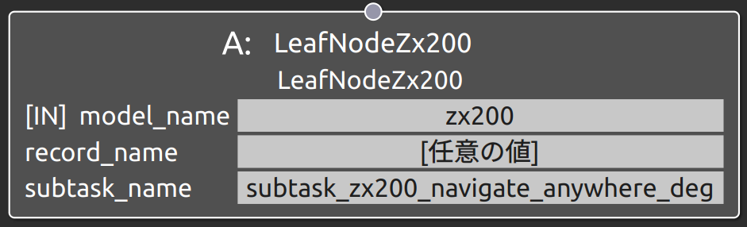
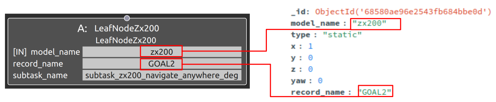

subtask_zx200_navigate_anywhere_deg
===================================

概要
-----------
共通制御信号対応バックホウZX200をナビゲーション操作するSubtask Nodeの1つ。
バックホウの目標位置姿勢を指定し、それに向かってナビゲーションを行う。
subtask_zx200_navigate_anywhereと機能は同じであるが、姿勢はdegreeを用いて指定する点が異なる。

対応表
-----------

.. image:: ../images/対応表_simok_actok.png
   :alt: 対応表
   :width: 800px
   :align: center  

.. raw:: html

     

使用方法
-----------
- **model_name** : "zx200"と指定
- **record_name** : 接続するSubtask Nodeの仕様に合わせたパラメータデータのrecord_nameの値を指定
- **subtask_node** :  "subtask_zx200_navigate_anywhere_deg"と指定。

  
.. raw:: html

.. raw:: html

     

パラメータデータの仕様
-----------

Map座標基準での目標位置姿勢を指定する。
姿勢はmap座標からみたbase_link座標の相対位置姿勢であり、位置はxyzのm基準、姿勢はdegreeで指定する。

.. image:: ../images/DB_SubtaskNavigateAnywhereDeg.png
   :alt: DB_SubtaskNavigateAnywhereDeg
   :width: 400px
   :align: center

.. raw:: html

       

※_id, model_name. description, record_name等の共通仕様は除外。詳しくは :doc:`こちら <../DataBase>` へ。

サンプル
-----------

**動作** : Map座標基準のx軸方向1m地点へ移動。目標地点ではbase_linkとmapの姿勢を合わせる。

