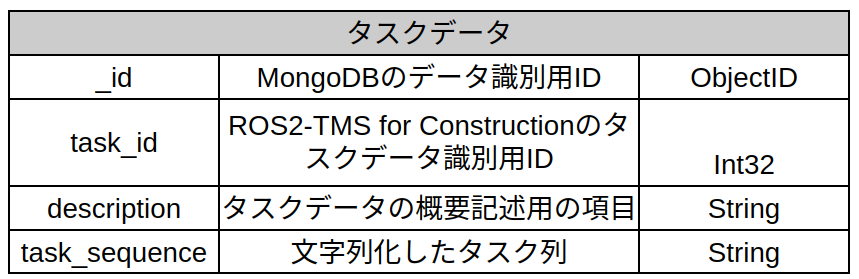
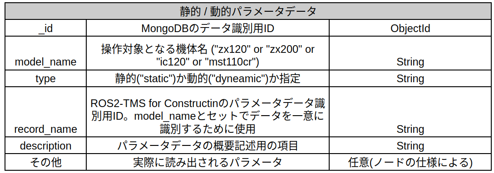
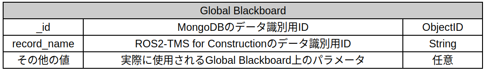

.. _datas-detail:

データベースの概要
===================================

ROS2-TMS for ConstructionのデータベースはMongoDBのrostmsdbデータベース上に構築されており、
特にタスク管理機構ではrostmsdbデータベース下のparameterコレクションとtaskコレクション下のデータを使用します。
各々の概要とそこに格納するデータの概要は以下に示すとおりです。

- **taskコレクション**

タスクデータを保管するコレクションです。ここに格納するデータの仕様は以下に示すとおりです。

.. raw:: html

     

なお、上記のタスクデータは :doc:`こちら <TaskManagementMechanism>` の手順にしたがってXML形式のタスク列から自動で生成されます。

- **parameterコレクション**

パラメータデータを保管するためのコレクションです。ここには動的・静的パラメータや
Global Blackboardが格納されます。各々の仕様は以下に示すとおりです。

.. raw:: html

     

.. raw:: html

     

なお、動的パラメータとはタスク実行中に外部から更新可能なパラメータを、静的パラメータとは
タスク実行時に指定された値がタスク終了時まで固定されているパラメータを指しています。

Parameterデータの追加方法
---------------------------------

ROS2-TMS for Constructionではこちらで説明したように、タスク実行中に動的/静的パラメータを読み出します。
このため、タスク実行前に予めパラメータデータをデータベース上に準備しておく必要があります。
以下はそのパラメータデータの追加手順です。

1. 以下のコマンドを実行し、MongoDBを起動します。::
   
      sudo systemctl start mongod
   
2. 以下のコマンドを実行し、MongoDB Compassを起動します。::
   
      mongodb-compass
   
3. ポップアップするMongodbの画面にて、URIで"mongodb://localhost:27017/"と指定されていることを確認し、"Connect"ボタンをクリックします。そして遷移先の
   画面でrostmsdb → parameterをクリックすると以下の画面が表示されます。

   .. image:: images/parameter_collection.png
      :alt: パラメータコレクション
      :width: 400px
      :align: center  

   .. raw:: html

        
   
4. 上記の画面で ADD DATA → Insert Document をクリックすると以下の画面が開くので、ここで所望のパラメータデータを作成します。
   各ノードで使用するパラメータデータの仕様は :doc:`こちら <CustomNodes>` で説明したとおりです。
   また、これ以外に必要なデータに関しては `こちら <_datas-detail>`_  に記載のあるノードの仕様に沿って、他のパラメータデータも参考に作成してください。

   .. image:: images/insert_document_db.png
      :alt: mongodbのデータ追加画面
      :width: 400px
      :align: center  

   .. raw:: html

        

