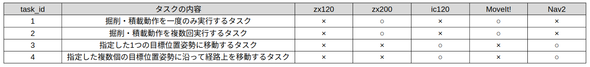

Getting Started
===================================

本章ではROS2-TMS for Constructionのインストール及びROS2-TMS for Constructionから
OperaSim-PhysX上の建設機械を実際に動作させるまでの流れを説明する。

インストール
===================================

以下のコマンドを実行する。::

      cd
      mkdir -p ~/ros2-tms-for-construction_ws/src && cd ~/ros2-tms-for-construction_ws/src
      git clone https://github.com/irvs/ros2_tms_for_construction.git
      cd ros2_tms_for_construction
      . setup.sh

.. _sample-task-execusion:

チュートリアル
===================================

本章ではタスク管理機構を使用して建設機械を操作する流れを説明する。
ROS2-TMS for Constructionでは以下に示すいくつかのサンプルタスクが用意されている。

  
.. raw:: html

     

これらのタスクは共通制御信号対応の建設機械の実機に加え、OperaSim-PhysX/AGX上の建設機械を操作することが可能である。
これらのタスクはデータベース上の~/rostmsdb/task以下に格納されている。
また、xml形式のタスク列については `こちら <https://github.com/irvs/ros2_tms_for_construction/tree/develop/ts/tms_ts/tms_ts_manager/config/official_registred_tasks>`_ 
に置いてある。

これらのタスクは操作する建設機械によって起動する手順が異なるため、項目を分けて説明する。
なお、以下を実行する前に必ず `こちら <https://github.com/pwri-opera/OperaSim-PhysX>`_ の手順にしたがって
<<<<<<< Updated upstream
OperaSim-PhysXとUbuntu22.04 PC間の接続ができていることを確認しておく必要があります。

- **タスク1,2,3の実行**
  
  このタスクはナビゲーションやマニピュレーションを使用せず、直接シミュレータに関節角度
  を送ることで建設機械を操作する。具体的な実行手順は以下のとおりである。

  1つめのターミナル::

    cd ~/ros2-tms-for-construction_ws && source install/setup.bash
    ros2 launch ros_tcp_endpoint endpoint.py

  2つめのターミナル::

    cd ~/ros2-tms-for-construction_ws && source install/setup.bash
    ros2 launch tms_ts_launch tms_ts_construction.launch.py task_id:=<task_id>    

  ※ <task_id>には4,5のどちらかの値を指定してください

  // タスク1,2,3の実行結果の動画をここに貼り付け
=======
OperaSim-PhysXとUbuntu22.04 PC間の接続ができていることを確認しておく。

>>>>>>> Stashed changes

- **タスク1,2の実行**
  
  バックホウZX200のマニピュレーション操作を含むタスクである。このため、自律化施工基盤OPERA
  のzx200_ros2を起動する必要がある。具体的には、OPeraSim-PhysXを起動しUbuntu 22.04 PCと接続可能な状態で以下の順にコマンドを実行してください。

  1つめのターミナル::

    cd ~/ros2-tms-for-construction_ws && source install/setup.bash
    ros2 launch ros_tcp_endpoint endpoint.py

  2つめのターミナル::

    cd ~/ros2-tms-for-construction_ws && source install/setup.bash
    ros2 launch zx200_bringup vehicle.launch.py command_interface_name:=velocity use_rviz:=true

  3つめのターミナル::

    cd ~/ros2-tms-for-construction_ws && source install/setup.bash
    ros2 launch tms_if_for_opera tms_if_for_opera.launch.py
  
  4つめのターミナル::

    cd ~/ros2-tms-for-construction_ws && source install/setup.bash
    ros2 launch tms_ts_launch tms_ts_construction.launch.py task_id:=<task_id>
  
  ※ <task_id>には1,2のどちらかの値を指定してください

  //タスク1,2の実行結果の様子をここに貼り付け

- **タスク6,7の実行**
  
  クローラダンプIC120のナビゲーション操作を含むタスクである。このため、自律化施工基盤OPERA
  のic120_ros2を起動する必要がある。具体的には、OPeraSim-PhysXを起動しUbuntu 22.04 PCと接続可能な状態で以下の順にコマンドを実行してください。

  1つめのターミナル::

    cd ~/ros2-tms-for-construction_ws && source install/setup.bash
    ros2 launch ros_tcp_endpoint endpoint.py

  2つめのターミナル::

    cd ~/ros2-tms-for-construction_ws && source install/setup.bash
    ros2 launch ic120_unity ic120_standby_ekf.launch.py

  3つめのターミナル::

    cd ~/ros2-tms-for-construction_ws && source install/setup.bash
    ros2 launch tms_ts_launch tms_ts_construction.launch.py task_id:=<task_id>

  ※ <task_id>には3,4のどちらかの値を指定してください

  //タスク3,4の実行結果の様子をここに貼り付け

  なお、上記のサンプルタスクについて、なお、 :doc:`こちら <TaskManagementMechanism>` に示す手順にしたがって、既存のタスクをもとに別のタスクを構築したり、タスクを実行している様子を可視化することが可能です。

上記のサンプルサブタスクは :doc:`こちら <TaskManagementMechanism>` に示す手順にしたがって、既存のサンプルタスクをもとに別のタスクを構築したり、タスクを実行している様子を可視化することが可能です。

